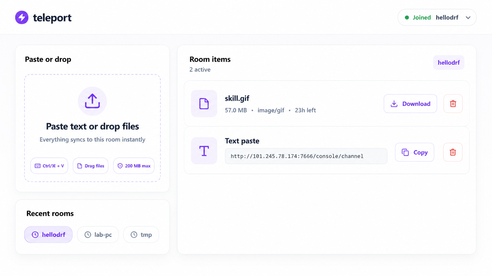

# teleport

[](https://github.com/acore2026/teleport/actions/workflows/ci.yml)
[](https://github.com/acore2026/teleport/releases)
[](https://github.com/acore2026/teleport/pkgs/container/teleport)

**teleport** is a fast room-based paste and file shuttle for web and desktop. Create or join a room, paste text, drop files, and every connected client sees the same recent items instantly. Items expire automatically after 24 hours, so rooms stay lightweight.



## Highlights

- Real-time room sync over Server-Sent Events.
- Text pastes, file drops, image paste support, image previews, and one-click copy/download.
- 24-hour auto-destroy for every item.
- Lightweight room model: no account system, no device list, no generated share flow.
- Client-side text encryption before upload; files are transferred and stored as uploaded.
- Desktop tray/minified mode for Windows, Linux, and macOS.
- Desktop clipboard automation: capture clipboard text/images and copy incoming text/images.
- Production Docker image with nginx in front of the Node API.

## Quick Start With Docker

```bash
docker compose up -d --build
```

Open:

```text
http://localhost:7777/
```

Or build and run manually:

```bash
docker build -t teleport:production .

docker run -d \
  --name teleport \
  --restart unless-stopped \
  -p 7777:7777 \
  -v teleport-data:/app/data \
  teleport:production
```

The container serves the web UI on port `7777`, proxies `/api/*` to the internal Node server, and accepts files up to `200 MB`.

## Desktop Clients

Standalone desktop builds are published on the [GitHub Releases](https://github.com/acore2026/teleport/releases) page:

- `teleport-windows-x64-standalone.zip`
- `teleport-linux-x64-standalone.tar.gz`
- `teleport-macos-x64-standalone.tar.gz`
- `teleport-macos-arm64-standalone.tar.gz`

The desktop app starts in minified mode by default. Use the tray/status icon to open the compact panel, paste directly, copy/download recent items, or open the full window.

Desktop settings include:

- Server address.
- Minified mode toggle.
- Global shortcut bindings.
- Clipboard capture.
- Auto-copy incoming text/images.

## Local Development

Requirements:

- Node.js `24+`
- npm
- Rust stable and Tauri prerequisites for desktop builds

Install dependencies:

```bash
npm install
```

Run the web app in development:

```bash
npm run dev
```

Build the frontend and server:

```bash
npm run build
```

Run the compiled server:

```bash
npm start
```

Run the desktop client in development:

```bash
npm run desktop:dev
```

Check the desktop project:

```bash
npm run desktop:check
```

Build standalone desktop binaries:

```bash
npm run desktop:standalone:linux
npm run desktop:standalone:windows
npm run desktop:standalone:macos:x64
npm run desktop:standalone:macos:arm64
```

Linux desktop builds require WebKitGTK and appindicator development packages. macOS target builds must run on macOS. The CI workflow documents the packages and runners used for each platform.

## Project Structure

```text
src/                 React/Vite frontend
src/main.tsx         Main application UI and desktop-aware behavior
src/styles.css       Global light theme and responsive layout
server/              TypeScript Express API, SQLite storage, uploads, SSE
src-tauri/           Tauri desktop client
docker/              nginx config and container entrypoint
docs/assets/         README screenshots and design references
.github/workflows/   CI, Docker publish, and release builds
data/                Local runtime data, ignored by git
```

## Configuration And Data

Web/server runtime data is stored under `data/` locally. In Docker, keep the `/app/data` volume mounted so uploads and SQLite data survive container replacement.

Desktop standalone settings are stored in the operating system app config directory for `dev.teleport.desktop`, not next to the executable:

- Windows: `%APPDATA%\dev.teleport.desktop\settings.json`
- Linux: `~/.config/dev.teleport.desktop/settings.json` or `$XDG_CONFIG_HOME/dev.teleport.desktop/settings.json`

Room passwords use the OS credential store when available. Browser-only usage falls back to local browser storage.

## GitHub Builds And Releases

The repository ships with two workflows:

- `CI`: checks the web/server build, Docker image build, and desktop Tauri project.
- `Publish`: publishes the Docker image to GitHub Container Registry and uploads Windows/Linux/macOS standalone clients to GitHub Releases.

Publish a release:

```bash
git tag v1.0.1
git push origin v1.0.1
```

Docker images are published as:

```text
ghcr.io/acore2026/teleport:latest
ghcr.io/acore2026/teleport:v1.0.1
ghcr.io/acore2026/teleport:sha-<commit>
```

## Notes

- Room names may contain letters, numbers, hyphens, and underscores.
- Items expire after 24 hours and are cleaned automatically.
- Maximum text size is `1 MB`.
- Maximum file size is `200 MB`.
- Uploaded files and SQLite databases should never be committed.
